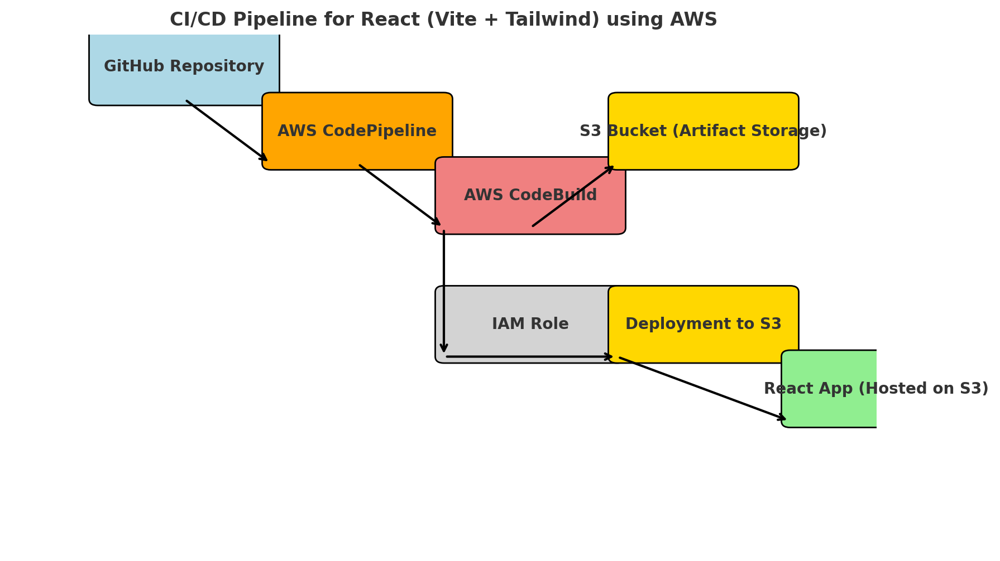

# Continuous Integration and Continuous Delivery/Continuous Deployment for React (Vite + Tailwind)

Continuous Integration and Continuous Deployment (CI/CD) is essential for automating the deployment process of web applications. In this guide, we'll walk through setting up a CI/CD pipeline using AWS services to deploy a React (Vite + Tailwind CSS) application.



## Prerequisites

Before starting, ensure you have:
- An AWS account
- A GitHub repository with your React (Vite + Tailwind) project
- AWS CLI configured on your local machine
- Basic knowledge of AWS services

## Follow the steps to create a CI/CD pipeline in this folder
Additionally, a step-by-step guide is provided below.

---

## Step 1: Set Up a GitHub Repository

1. Create a new repository on GitHub.
2. Push your React (Vite + Tailwind) project to your repository.

---

## Step 2: Create an S3 Bucket

1. Go to AWS Management Console.
2. Search for **S3** in the AWS search bar and open the service.
3. Click on **Create bucket**.
4. Enter a unique bucket name (e.g., `my-static-site-bucket`). Ensure:
   - The name is unique across AWS.
   - It contains only lowercase letters, numbers, hyphens, and dots.
5. Choose a region close to your location.
6. Scroll down to **Block Public Access settings for this bucket**.
7. Ensure all options are checked (default setting) and **uncheck public access** if required.
8. Click **Create bucket**.

---

## Step 3: Create a CodeBuild Project

1. Go to **AWS Management Console**.
2. Navigate to **CodeBuild** and create a new project.
3. Enter a **Project Name**.
4. Choose **Source provider: GitHub**.
5. Select **Operating System: Ubuntu**.
6. Choose **BuildSpec - Insert build commands**.

### Buildspec YAML File:

```yaml
version: 0.2

phases:
  install:
    runtime-versions:
      nodejs: 22.x  # Ensure CodeBuild supports this version
    commands:
      - echo "Installing dependencies..."
      - npm install

  build:
    commands:
      - echo "Building the React app..."
      - npm run build

artifacts:
  files:
    - '**/*'
  base-directory: dist  # Change to 'dist' if using Vite

cache:
  paths:
    - 'node_modules/**/*'
```

7. **Artifact Setup:**
   - Choose **Amazon S3**.
   - Select **your S3 bucket name**.
   - Use the artifact created in your S3.
8. **Namespace Type:** Choose **Build ID**.
9. Click **Create Project**.

---

## Step 4: Create an IAM Role

1. **Go to IAM Console:** Open the [AWS IAM Console](https://console.aws.amazon.com/iam/).
2. Click **Roles** in the left sidebar.
3. Click **Create role**.
4. **Choose Trusted Entity:**
   - Select **Custom trust policy** (instead of AWS service).
5. **Add the Trust Policy:**

```json
{
  "Version": "2012-10-17",
  "Statement": [
    {
      "Effect": "Allow",
      "Principal": {
        "Service": "codepipeline.amazonaws.com"
      },
      "Action": "sts:AssumeRole"
    }
  ]
}
```

6. Click **Next** and attach the following AWS-managed policies:
   - `AWSCodePipelineFullAccess`
   - `AWSCodeBuildAdminAccess` (if using CodeBuild)
   - `AmazonS3FullAccess` (if using S3)
   - `AWSCodeDeployFullAccess` (if using CodeDeploy)
7. Click **Next**, enter a **Role Name** (e.g., `CodePipelineServiceRole`).
8. Click **Create role**.

---

## Step 5: Create a CodePipeline

1. **Go to AWS Management Console** and search for **CodePipeline**.
2. Click **Create Pipeline**.
3. Enter a **Pipeline Name**.
4. **Service Role:**
   - Choose **Existing role**.
   - Select the IAM role created in **Step 4**.
   - Enter the **Role ARN**.
5. **Source Provider:**
   - Choose **GitHub (via GitHub App)**.
   - Connect your GitHub account.
   - Select your **repository** and **branch**.
6. **Build Option:**
   - Choose **Other build providers**.
   - Select **AWS CodeBuild**.
   - Choose your **CodeBuild project**.
7. **Deployment Option:**
   - Choose **Amazon S3** (or another deployment option as per your needs).
8. **Review your pipeline**.
9. Click **Create pipeline**.

After creating your pipeline, it will automatically push updates to your React app when changes are made in your repository.

---

## 🎉 Congratulations! 🎉
You have successfully set up a CI/CD pipeline for your React (Vite + Tailwind) application! 🚀

